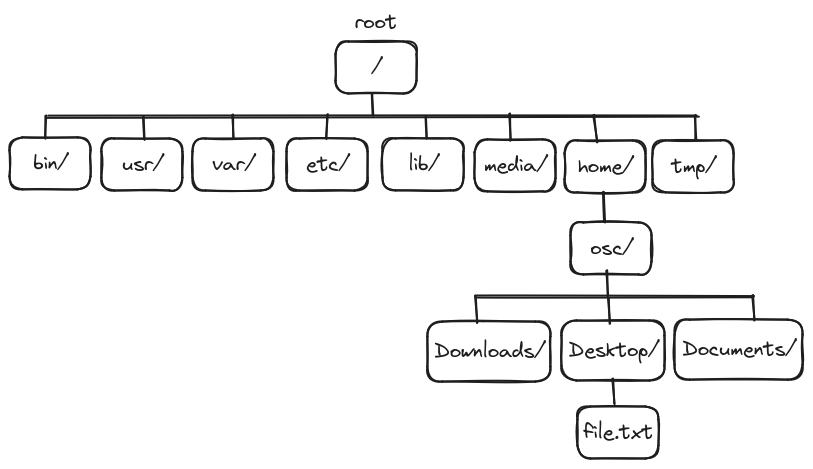

# Introduction to Command Line

## The Shell

When we speak of the command line, we are really referring to the shell. The shell is a program that takes commands and passes them to the operating system to carry out. Almost all Linux distributions supply a shell program from the GNU project called `bash`.

## Understanding Commands

Commands are programs that we run from the shell instead of a GUI application.

### Command Breakdown

```.
PROGRAM [OPTIONS] [ARGUMENT]
```

Commands usually breakdown to three parts:

- **PROGRAM**: is the program name or path in the system, examples: firefox, java, etc...
- **[OPTIONS]**: are special argument that alter the default behaviour of the program, and most of the time they are optional.
- **[ARGUMENT]**: are the arguments that the program operate on, and also most of the time they are optional.

> **Note:** There are two different formats for *[OPTIONS]*:
>
>   - Short format: usually starts with a dash '`-`' followed by a single letter, example: `-a`.
>   - Long format: usually starts with a double dash '`--`' followed by a word, like `--all`.

Take for example the following commands:

`echo [OPTION] [STRING]`
: Displays string of text.

| Option | Usage |
|--------|-------|
| `-n` | Do not output the trailing newline. |
| `-e` | Enable interpretation of backslash escapes. |
| `-E` | Disable interpretation of backslash escapes. (default) |

```bash
osc@osc:~$ echo Hello World
Hello World
osc@osc:~$ echo -n "Hello, "
echo "World!"
Hello, World!
osc@osc:~$ echo -e "Hello\nWorld"
Hello
World
osc@osc:~$ echo -E "Hello\nWorld"
Hello\nWorld
```

`clear`
: Clears the screen.

```bash
osc@osc:~$ echo Hello World
Hello World
osc@osc:~$ clear
```

Output:

```bash
osc@osc:~$
```

## Linux File System Hierarchy
If you’re new to the Linux system, you may be confused by how it references files and directories. Before exploring the Linux system, it helps to have an understanding of how it’s laid out.

Linux stores files within a **single directory structure**, called a **virtual directory**. The virtual directory contains file paths from **all the storage devices installed on the computer**, merged into a **single directory** structure. The Linux virtual directory structure contains a single base directory, called the **root**. Directories and files beneath the root directory are listed based on the directory path used to get to them.

The tricky part about the Linux virtual directory is how it incorporates each storage device. The first hard drive installed in a Linux system is called the root drive (`/`). The root drive contains the virtual directory core. Everything else builds from there. On the root drive, **Linux can use special directories as mount points**. Mount points are directories in the virtual directory where you can **assign additional storage devices**. Linux causes files and directories to appear within these mount point directories, even though they are physically stored on a different drive.

Often system files are physically stored on the root drive. User files are typically stored on a separate drive or drives, as shown below.



### '/' Directory

The '`/`' directory or the "root" directory is where everything begins on Linux.

No matter what you want to access, where it is, it will somehow connect to the root directory.

The '`/`' character is also used as a directory separator in file names. For example, if `etc` is a subdirectory of the `/` directory, you could refer to that directory as `/etc`. Likewise, if the `/etc` directory contained a file named `issue`, you could refer to that file as `/etc/issue`.

### Top Level Directories

| Directory | Content / Description |
| --------- | --------------------- |
| `/` | The root of the virtual directory. It is the **starting point** for the file system hierarchy                 |
| `/boot` | Boot directory, where **boot files** are stored (e.g, Linux kernel and other static files of the boot loader).|
| `/media`| Media directory, a common place for mount points used for **removable media**.                                |
| `/mnt` | Mount directory, another common place for mount points used for **removable media**.                          |
| `/etc` | **System configuration** files directory.                                                                     |
| `/bin` | Binary directory, where many **essential user command binaries** are stored.                                  |
| `/sbin` | System binary directory, where many **system administration binaries** are stored.                            |
| `/usr` | User binary directory, where the **applications and files used by users** are stored (/usr/ is the second major section of the filesystem (secondary hierarchy).  |
| `/tmp` | Temporary directory, where **temporary work files** can be created and destroyed (these temporary files are generally deleted when the system is restarted). |
| `/var` | Variable directory, for **files that change frequently** which handled by services, such as logs, queues, caches, and spools. |
| `/home` | Home directory, where Linux creates **normal user** directories (non-root users).                             |
| `/root` | The home directory for the **root user** (administrative superuser).                                          |

## Navigating the System

`pwd`
: Prints the absolute path of the current working directory.

```bash
osc@osc:~/Downloads$ pwd
/home/osc/Downloads
```

`cd [DIRECTORY]`
: Change directory.

To change our working directory, we use the `cd` command.

```bash
osc@osc:~$ cd /home/osc/Downloads
osc@osc:~/Downloads$
```

Now , our working directory here is `Downloads`.

### Absolute Path

An absolute path begins with the root directory '`/`' and follows the tree branch by branch until the path to the desired directory or file is completed.

For example, there is a directory on our system in which most of our system's programs are installed. The directory’s path is "`/usr/bin`". This means from the root directory (represented by the leading slash '`/`' in the path), there is a directory called "usr", which contains a directory called "bin".

```bash
osc@osc:~$ cd /usr/bin
osc@osc:/usr/bin$ pwd
/usr/bin
osc@osc:/usr/bin$
```

### Relative Path

Where an absolute path starts from the root directory '`/`' and leads to its destination, a relative path starts from the working directory.

The '`.`' notation refers to the working directory, and the '`..`' notation refers to the working directory's parent directory.

The working directory here is `usr`.

```bash
osc@osc:/usr/$ cd ./bin
osc@osc:/usr/bin$ pwd
/usr/bin
```

In almost all cases, we can omit the `./`.

```bash
osc@osc:/usr/$ cd bin
osc@osc:/usr/bin$ pwd
/usr/bin
```

| Command | Usage |
|---------|-------|
| `cd ..` | Change the current working directory to the parent directory of the current directory. |
| `cd` | Change the working directory to your `home` directory. |
| `cd -` | Changes the working directory to the previous working directory. |
| `cd ~user_name` | Changes the working directory to the `home` directory of user_name. |

`ls [OPTION] [FILE]`
: Lists directory contents.

```bash
osc@osc:~$ ls
Desktop  Documents  Downloads  Music  Pictures  Public  Templates  Videos
```

Besides the current working directory, we can specify the directory to list:

```bash
osc@osc:~$ ls /home
osc
```

| Option | Usage |
|--------|-------|
| `-l` | Displays detailed information about files. |
| `-a` | List all files, including the hidden files. |
| `-t` | Sort files by modification time, with the newest files appearing first. |
| `-r` | Reverse the order of the sort to display files in reverse order. |
| `-S` | Sort files by size, with the largest files appearing first. |

## Exploring the System

`cat [OPTION] [FILE]`
: Display contents of a file, concatenate files and print on the standard output.

```bash
osc@osc:~/Documents$ cat myFile
hello world
```

| Option | Usage |
|--------|-------|
| `-n` | Number the lines of the output. |
| `-s` | Suppress repeated empty output lines. |
| `-E` | Display a dollar sign ($) at the end of each line. |

`file`
: Determine file type.

```bash
osc@osc:~/Documents$ file myFile
myFile: ASCII text
```

`type`
: It is used to find out whether it is a built-in or external binary file.

```bash
osc@osc:~$ type cd
cd is a shell builtin
```
