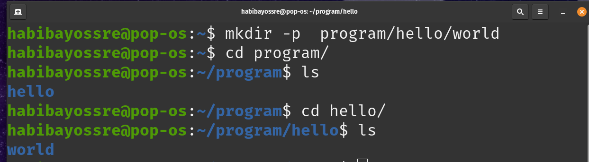

# Chapter 4
- Files and directories
    - `mkdir` done
    - `touch` done
    - `rm`     done
    - `cp`    done
    - `mv`
    - *`ln`*
  - Help
    - `man`
    - `apropos`
    - `--help`
_ _ _ 
# 📂Create Directories
---
* **`mkdir DirectoryName`**
This command will create a new directory, provided it doesn't exists.

>*Example :*
> Create a new directory his name is Test.

* **`mkdir -p Directory/SubDirectory1/SubDirectory2`**

This command will create nested directories.

>*Example:* 
>Create nested directories, **world** directory which is inside the **hello** directory which is inside the**program**directory.

---
# 📄**Creating Files**
---

* **`touch fileName`**
This command will create a new file.

>Example :
>Create a new files file1.txt , file2.txt , file3.txt.

---
# Renaming & Moving Files
---
# Copying Files & Directories

With the `mv` command, you could move or rename a file or directory, but you could not duplicate it. 
*  `cp SourceFile CopyFile` 
This command can make a new copy of an existing item
  
>*Example :* 
>copy `source.txt` file to a new file called `copy.txt`.

* `cp -r SourceDir CopyDir`
Copy entire directories, you must include the -r option to the command. This stands for “recursive”, as it copies the directory, plus all of the directory’s contents.

>*Example :*
>Copy the `test1` directory structure to a new structure called `test2`

---
# Removing Directories & Files
---

| *Command* | *Description*📝 |
| ---- |----|
| **`rm filename`** |Deletes a file|
| **`rm -f filename`** |Deletes by force and don't prompt the user|
| **`rm -r DirectoryName`** |Deletes a non-empty directory| 
| **`rm -d directory_name`**|Deletes an empty directory|

---

